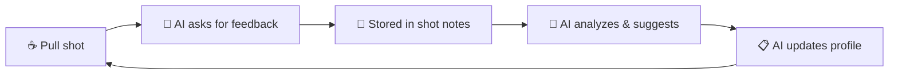

# Gaggimate MCP Server

> **DIY AI Barista** — Let your AI agent directly control your Gaggimate

You can already ask an LLM for advice on how to dial your espresso, and models like Claude, ChatGPT, or Gemini can already generate Gaggimate profiles in JSON format.

This repository provides two things:

1. **An MCP server** that allows your LLM agent to directly interact with your Gaggimate machine—no copy-pasting or manually uploading required. Your LLM agent can read your shot history, analyze extractions, store your tasting feedback, upload generated profiles, and adjust them based on your results and wishes.

2. **Instructions, knowledge, and a skill** to guide the agent on how to help you dial your espresso—turning a general-purpose LLM into a barista coach that understands basic extraction theory, tasting vocabulary, and Gaggimate's profile system.

## Table of Contents

- [What's in this Repository](#whats-in-this-repository)
- [Changelog](#changelog)
- [The Dialing Flow](#the-dialing-flow)
- [Example Conversations](#example-conversations)
- [MCP Tools](#mcp-tools)
- [Safety Guardrails](#safety-guardrails)
- [Requirements](#requirements)
- [Quick Start](#quick-start)
- [Claude Desktop Project Setup (Optional)](#claude-desktop-project-setup-optional)
- [Configuration (Optional)](#configuration-optional)
- [Troubleshooting](#troubleshooting)
- [How It Works](#how-it-works)
- [Local Data Storage](#local-data-storage)
- [Development](#development)
- [Why a Skill Instead of a Knowledge File?](#why-a-skill-instead-of-a-knowledge-file)
- [Project Structure](#project-structure)
- [Related](#related)
- [License](#license)

## What's in this Repository

**MCP Server** — Five tools that give your AI direct access to your machine:
- **Read shot data** — Temperature curves, pressure readings, flow rates, extraction timing
- **Manage profiles** — Create, update, and list brewing profiles directly on your device
- **Track feedback** — Record ratings and tasting notes synced to your Gaggimate
- **Browse history** — List recent shots with filtering
- **Diagnose issues** — Automated connection troubleshooting

**Knowledge & Instructions** — Reference materials that transform a general-purpose LLM into a functional barista coach:
- Espresso extraction theory and shot styles
- Tasting vocabulary (how to describe sour vs bitter, body, sweetness)
- Complete Gaggimate profile schema and examples
- Agent instructions with dialing workflows

**Skills** — A Claude Desktop skill for efficient profile creation using progressive disclosure (loads detailed references only when needed).

See [Example: Using ChatGPT to manually create profiles for Gaggimate by Dule Rabbit](https://youtu.be/kjhwed1PZvg) — this MCP server automates that entire workflow.

## Changelog

### 2026-02-03
- **Partial profile updates**: Update only the fields you want to change (temperature, phases, or name) - omitted fields keep their existing values
- **Delete profiles**: Added `action='delete'` to `manage_profile` with safety guardrails:
  - Only AI-created profiles (ending with ` [AI]`) can be deleted
  - Requires explicit `confirm_delete=True` to prevent accidents
  - Deleted profiles can be recovered from local backup (see [Local Data Storage](#local-data-storage))
- **Shot notes simplified**: `action='get'` now reads from device (source of truth); local storage is backup-only for users
- **Local Data Storage docs**: Added documentation explaining what's stored locally and agent access limitations
- **Bug fix**: Fixed `get_profile` → `load_profile` method call that was causing update failures

### 2026-02-02
- **Configurable AI markers** (`edc8d98`): AI profile suffix and notes prefix are now configurable via `GAGGIMATE_AI_PROFILE_SUFFIX` and `GAGGIMATE_AI_NOTES_PREFIX` environment variables
- **Bug fix** (`a350246`): Profile updates now preserve valve settings and profile type (simple/pro) instead of resetting them
- **Automatic Pro documentation** (`bfc2ca0`): Added comprehensive guide for Automatic Pro profiles with flow-based variable pressure examples

---

## The Dialing Flow



**Iteratively improve your shots with AI-guided feedback:**

1. **Pull a shot** and taste it
2. **AI prompts you for feedback**—it'll ask targeted questions about balance (sour/bitter), body, sweetness, and specific flavors to help you articulate what you're tasting
3. **Feedback is saved** to your shot notes on Gaggimate, creating a record of your dialing journey
4. **AI analyzes** your shot data (pressure curves, temperature, flow) combined with your tasting notes
5. **AI suggests adjustments**—explaining *why* (e.g., "that sourness suggests under-extraction, let's grind finer or increase temperature")
6. **AI updates your profile** directly on your machine, or recommends grind changes
7. **Repeat** until dialed in

**Getting started with a new coffee:**
- Share a photo of your coffee bag, or just tell the AI what you're brewing
- The AI will **research your beans** using web search—finding roaster info, processing method, altitude, variety, and tasting notes
- Based on that research plus your equipment and preferences, it creates an optimized starting profile
- On first use, it'll ask about your setup (machine, grinder, basket size) to give better recommendations

## Example Conversations

**Getting started:**
> "Here is a picture of this coffee I got. Can you please research it and create a Gaggimate profile for it?"

**Giving feedback:**
> "I just pulled a shot—ask me about it"
>
> *AI will prompt: "How would you rate it 1-5? Was it sour, balanced, or bitter? Anything else you noticed—sweetness, body, specific flavors?"*

**Recording notes:**
> "Can you please update the feedback for my most recent shot. It tasted a bit bitter. Give it a 2/5 rating. I used grind setting 12 with 15g in and 30g out."

**Analyzing patterns:**
> "Please look at all my recent shots with the Amizade coffee beans. Based on my feedback in each shot, how should we adjust the profile?"

**Creating a profile:**
> **You:** I have some light roast Ethiopian beans. Can you create a profile?
>
> **AI:** I'll create a profile optimized for light roast Ethiopian beans. Light roasts typically benefit from higher temperatures and longer pre-infusion...
>
> *Creates "Ethiopian Light [AI]" profile with appropriate settings*

**Analyzing a shot:**
> **You:** Analyze my last shot, it tasted sour
>
> **AI:** Looking at shot #127... The extraction was 24 seconds with an average pressure of 8.2 bar. The flow rate increased rapidly after pre-infusion, which combined with the sour taste suggests under-extraction. I'd recommend:
> 1. Grinding finer
> 2. Increasing temperature by 1-2°C
> 3. Extending pre-infusion time

**Tracking progress:**
> **You:** Rate that last shot 4 stars - much better, slight bitterness remaining
>
> **AI:** I've saved your rating and notes. Looking at your progression, your last 3 shots have improved from 2 to 4 stars. The bitterness might indicate we're now slightly over-extracting. Want me to adjust the profile?

## MCP Tools

This server provides five tools that give AI agents the capabilities they need to help with your espresso workflow:

### `manage_profile`
Create, view, update, delete, and list brewing profiles on your Gaggimate device. Profiles define the entire extraction process—water temperature, pre-infusion settings, pressure curves, and flow targets. The AI can build profiles optimized for specific beans or brewing styles. **Partial updates** are supported—you can change just temperature, phases, or name without respecifying everything. Profiles created by AI are automatically tagged with `[AI]` in their name so you can identify them.

### `analyze_shot`
Retrieve comprehensive data from any shot, including temperature curves, pressure readings, flow rates, and extraction timing. The raw binary shot logs are parsed and transformed into an AI-friendly format with computed statistics like average pressure, temperature stability, and total extraction volume. This gives the AI the context it needs to understand what happened during extraction.

### `manage_shot_notes`
Record ratings (0-5 stars), tasting notes, and brewing parameters for any shot. Notes are synced directly to your Gaggimate device via WebSocket and also stored locally as backup. You can track taste balance (bitter/balanced/sour), grind settings, and dose weights. Notes added by AI are prefixed with `[AI]:` for transparency.

### `list_recent_shots`
Browse your shot history with optional filtering. Returns a list of recent shots with their IDs, timestamps, profile names, and any ratings you've recorded. This helps the AI understand your brewing patterns and find shots to analyze or compare.

### `diagnose_connection`
Troubleshoot connectivity issues between the MCP server and your Gaggimate device. Runs automated tests for network reachability, HTTP port access, API availability, and common misconfigurations. Returns specific recommendations if problems are detected.

## Safety Guardrails

For safe operation, this MCP server enforces the following limits:

- **No shot control**: The AI cannot start, stop, or trigger espresso shots. It can only read shot data and manage profiles.
- **Temperature limits**: All temperatures are clamped to **25-100°C** to prevent damage or burns.
- **Pressure limits**: All pressures are clamped to **0-12 bar** to stay within safe operating ranges.
- **Profile attribution**: AI-created profiles are marked with ` [AI]` suffix (e.g., "Ethiopian Light [AI]") for transparency.
- **Delete protection**: The AI can only delete profiles it created (those ending with ` [AI]`). User-created profiles cannot be deleted by the agent. If you need to recover a deleted profile, see [Local Data Storage](#local-data-storage)—all profile versions are saved locally before deletion.

These limits are enforced at the configuration level and cannot be overridden through the MCP tools.

## Requirements

- A [Gaggimate](https://github.com/jniebuhr/gaggimate)-modded espresso machine (Gaggia Classic, etc.)
- An MCP host application (e.g., [Claude Desktop](https://claude.ai/download), [VS Code with GitHub Copilot](https://code.visualstudio.com/), or any other MCP-compatible client)
- Python 3.11+ with [uv](https://docs.astral.sh/uv/) package manager
- Same network access as your Gaggimate device

## Quick Start

### 1. Install uv (if not already installed)

[uv](https://docs.astral.sh/uv/) is a fast Python package manager. Install it with:

```bash
# macOS/Linux
curl -LsSf https://astral.sh/uv/install.sh | sh

# Or with Homebrew
brew install uv
```

### 2. Clone and Install

```bash
git clone https://github.com/julianleopold/gaggimate-mcp.git
cd gaggimate-mcp
uv sync
```

### 3. Configure Your MCP Client

Find your `uv` path (you'll need the full absolute path):
```bash
which uv
# Example output: /opt/homebrew/bin/uv
```

Get this repository's path:
```bash
pwd
# Example output: /Users/yourname/code/gaggimate-mcp
```

#### Claude Desktop

Open Claude Desktop settings: **Settings → Developer → Edit Config**

Add this configuration (replace paths with your actual values):

```json
{
  "mcpServers": {
    "gaggimate": {
      "command": "/opt/homebrew/bin/uv",
      "args": [
        "--directory",
        "/Users/yourname/code/gaggimate-mcp",
        "run",
        "mcp",
        "run",
        "src/gaggimate_mcp/server.py"
      ]
    }
  }
}
```

#### Other MCP Hosts (not tested)

For other MCP hosts, configure the server using the stdio transport with the command:
```bash
uv --directory /path/to/gaggimate-mcp run mcp run src/gaggimate_mcp/server.py
```

### 4. Restart Your AI Chat Application / MCP Host

Restart your AI chat application (e.g., Claude Desktop, VS Code) to load the new server configuration. You should see the Gaggimate tools become available.

### 5. Start Chatting!

Make sure you're on the same network as your Gaggimate device, then try:
- "List my Gaggimate profiles"
- "Show my recent espresso shots"
- "Diagnose my Gaggimate connection" (if having issues)

## Claude Desktop Project Setup (Optional)

This repository includes pre-built files for setting up a **Claude Desktop Project** dedicated to espresso dialing. Projects combine system instructions, knowledge files, and MCP tools into a focused workspace.

**Using a different AI?** You can copy-paste the knowledge files into any chat, or adapt the instructions for your preferred agent.

### What's Included

```
agent-instructions/
└── INSTRUCTIONS.md         # System primer for the espresso dialing agent

agent-knowledge/
├── GAGGIMATE_PROFILE_CREATION_GUIDE.md   # Complete JSON schema for profiles
├── ESPRESSO_BREWING_BASICS.md            # Extraction fundamentals & shot styles
└── ESPRESSO_TASTING_GUIDE.md             # How to evaluate shots & give feedback

agent-skills/
└── gaggimate-profiles/     # Claude Desktop Skill for profile creation
    ├── SKILL.md            # Skill definition (Agent Skills standard)
    └── references/         # Detailed reference docs loaded on-demand
```

### Setup Steps

1. **Create a new project** in Claude Desktop
2. **Add the system instructions**: Copy the contents of `agent-instructions/INSTRUCTIONS.md` into the project's system prompt
3. **Upload knowledge files**: Add all files from `agent-knowledge/` to the project's knowledge section
4. **Connect the MCP server**: Follow the [Quick Start](#quick-start) above
5. **Optional - Install the skill**: See [Appendix: Why a Skill?](#why-a-skill-instead-of-a-knowledge-file) for details

### How the Files Work Together

| File | Purpose |
|------|---------|
| **INSTRUCTIONS.md** | Defines the agent's personality, workflows for setup, coffee research, profile creation, and iterative dialing |
| **GAGGIMATE_PROFILE_CREATION_GUIDE.md** | Complete reference for building valid Gaggimate profiles—JSON schema, phase structure, pump modes, transitions, and examples |
| **ESPRESSO_BREWING_BASICS.md** | Explains extraction theory, shot styles (traditional, turbo, allongé, SOUP), and adjustment strategies |
| **ESPRESSO_TASTING_GUIDE.md** | Helps users describe what they taste—sour vs bitter, body, sweetness, finish—so the agent can make better recommendations |

## Configuration (Optional)

By default, the server connects to `gaggimate.local`, which should work automatically if your Gaggimate device is on the same network. **Most users can skip this section.**

If you need to customize the connection, create a `.env` file:

```bash
cp .env.example .env
```

Available settings:
```ini
GAGGIMATE_HOST=gaggimate.local    # Device hostname or IP
GAGGIMATE_PROTOCOL=ws             # Protocol (ws or http)
GAGGIMATE_LOG_LEVEL=INFO          # Logging level
```

If your device doesn't resolve via mDNS, use the IP address directly:
```ini
GAGGIMATE_HOST=192.168.1.100
```

## Troubleshooting

### "Failed to spawn process: No such file or directory"

This means your MCP host can't find `uv`. You must use the **full absolute path**:
- ❌ `"command": "uv"`
- ✅ `"command": "/opt/homebrew/bin/uv"`

Run `which uv` to find your correct path.

### Can't connect to Gaggimate

1. **Check network**: Are you on the same WiFi as your espresso machine?
   ```bash
   ping gaggimate.local
   ```

2. **Try IP address**: If mDNS doesn't work, find your device's IP in your router and update `.env`

3. **Use diagnostics**: Ask "diagnose my Gaggimate connection" for automated troubleshooting

### Browser shows "ERR_CONNECTION_REFUSED"

Browsers often auto-upgrade to HTTPS. Gaggimate uses HTTP:
- Use `http://gaggimate.local` explicitly (not https)
- Or use the IP address: `http://192.168.x.x`

## How It Works

```
┌─────────────────┐     ┌──────────────────┐     ┌─────────────────┐
│   MCP Client    │────▶│  Gaggimate MCP   │────▶│   Gaggimate     │
│  (Claude, etc.) │◀────│     Server       │◀────│   (ESP32)       │
└─────────────────┘     └──────────────────┘     └─────────────────┘
        │                       │                        │
        │    MCP Protocol       │    WebSocket/HTTP      │
        │    (stdio)            │    (local network)     │
```

The MCP server acts as a bridge:
- **WebSocket API** (`ws://gaggimate.local/ws`) - Profile management, shot notes
- **HTTP API** (`http://gaggimate.local/api/`) - Shot history and data files

Shot data is parsed from binary `.slog` files and transformed into an AI-friendly format with statistics about temperature, pressure, flow, and extraction timing.

## Local Data Storage

The MCP server stores some data locally on your machine (not on the Gaggimate device) for backup and version tracking purposes.

### What's stored locally

| Location | Contents | Purpose |
|----------|----------|--------|
| `./data/ratings.json` | Shot ratings and tasting notes | Backup of feedback synced to device |
| `./data/profiles/` | AI-created profile versions | Version history for rollback/comparison |

### Agent access to local storage

| Data | Agent Can Read | Agent Can Write |
|------|----------------|-----------------|
| Shot ratings | ❌ No - reads from device (source of truth) | ✅ Yes (backup copy) |
| Profile versions | ❌ No (user-only via filesystem) | ✅ Auto-saved on create/update |

Local storage is **write-only** from the agent's perspective—it saves backups automatically but always reads from the Gaggimate device. To access local backups (e.g., for recovery), browse the files directly in `./data/`.

### `ratings.json` structure

Stores your shot feedback indexed by shot ID:
```json
{
  "000105": {
    "shot_id": "000105",
    "rating": 4,
    "notes": "Updated by [AI]: Dark chocolate notes, syrupy body...",
    "timestamp": "2026-01-29T08:46:08.525676"
  }
}
```

### Profile versions

Each time the AI creates or updates a profile, a versioned copy is saved locally:
```
./data/profiles/
├── Agent-Ethiopian_Light__AI__v1.json
├── Agent-Ethiopian_Light__AI__v2.json   # After first adjustment
└── Agent-Ethiopian_Light__AI__v3.json   # After second adjustment
```

This allows you to:
- Track how profiles evolved during dialing
- Rollback to previous versions if needed
- Compare what changed between iterations

### Configuring storage location

You can change the storage path via environment variable:
```ini
GAGGIMATE_STORAGE_PATH=/path/to/custom/data
```

### Data privacy

- All local data stays on your machine
- Nothing is sent to external servers
- The AI agent only accesses your Gaggimate device on your local network

## Development

```bash
# Run tests
uv run pytest

# Run with coverage
uv run pytest --cov=gaggimate_mcp --cov-report=html

# Development mode (for debugging)
uv run mcp dev src/gaggimate_mcp/server.py
```

**Test Status:** 139 tests passing, 93% coverage

---

# Appendix

## Why a Skill Instead of a Knowledge File?

The profile creation guide is structured as a **Claude Desktop Skill** rather than a single knowledge file. This matters for token efficiency and response quality.

**The Problem with Large Knowledge Files:**
- Knowledge files are loaded into context for every conversation
- A 700+ line technical reference consumes tokens even when you're just chatting about taste preferences
- Large context windows can actually degrade response quality—the model has more to sift through

**How Skills Use Progressive Disclosure:**
- The main `SKILL.md` (~130 lines) loads only when triggered by profile-related requests
- Detailed references (pump modes, examples, troubleshooting) load **on-demand** when Claude needs them
- A simple "create a 9-bar profile" might only load the main skill + quick reference
- A complex "debug my pressure transition" loads the pump/transitions reference

**Practical Benefits:**
| Approach | Tokens Used | Best For |
|----------|-------------|----------|
| Single knowledge file | ~3,000 tokens (always) | Small references (<200 lines) |
| Skill with references | ~500-1,500 tokens (varies) | Large technical docs, context-dependent detail |

The skill is packaged as a ZIP file (`agent-skills/gaggimate-profiles.zip`) for easy upload to Claude Desktop via **Settings → Capabilities → Skills → Add**.

**Alternative: Just Use a Knowledge File**

If you prefer simplicity, you can skip the skill entirely and add `agent-knowledge/GAGGIMATE_PROFILE_CREATION_GUIDE.md` directly as a knowledge file in your Claude Desktop project. This works fine—the agent will have all the profile creation info it needs. The skill approach just optimizes for token efficiency when the full guide isn't needed for every conversation.

## Project Structure

```
gaggimate-mcp/
├── src/gaggimate_mcp/
│   ├── server.py           # MCP server with 5 tools
│   ├── config.py           # Configuration management (Pydantic)
│   ├── errors.py           # Structured error codes
│   ├── diagnostics.py      # Connection diagnostics
│   ├── logging_config.py   # Structlog JSON logging setup
│   ├── api/                # Device communication
│   │   ├── websocket.py    # WebSocket client (profiles, shot notes)
│   │   └── http.py         # HTTP client (shot history)
│   ├── parsers/            # Binary file parsers
│   │   ├── shot.py         # .slog shot file parser (V4/V5)
│   │   └── index.py        # index.bin parser
│   ├── models/             # Pydantic data models
│   │   ├── profile.py      # Brewing profile structure
│   │   ├── shot.py         # Shot data and statistics
│   │   └── rating.py       # Shot ratings and feedback
│   ├── transformers/       # Data transformation
│   │   └── shot.py         # Binary → AI-friendly format
│   └── storage/            # Local persistence
│       ├── ratings.py      # Shot ratings (JSON)
│       └── profiles.py     # AI-created profile versions
├── agent-instructions/     # Claude Desktop system prompt
├── agent-knowledge/        # Reference docs for the agent
├── agent-skills/           # Claude Desktop skills
├── tests/                  # 139 unit tests
└── data/                   # Local data (gitignored)
    ├── ratings.json        # Your shot ratings
    └── profiles/           # AI-created profile backups
```

## Related

- [Gaggimate Project](https://github.com/jniebuhr/gaggimate) - The ESP32 mod for Gaggia machines
- [Brew by AI](https://archestra.ai/blog/brew-by-ai) - Blog post about AI-assisted espresso brewing
- [MCP for Gaggimate in TypeScript](https://github.com/Matvey-Kuk/gaggimate-mcp) - Initial inspiration for this project (this Python implementation has since diverged)

## License

MIT License - See [LICENSE](LICENSE) for details.

---

**Made with ☕ for the espresso-obsessed**
