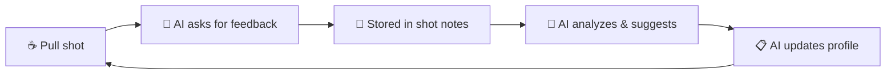

# Gaggimate MCP Server

> **DIY AI Barista** — Let your AI agent directly control your Gaggimate

**Blog Post:** [I Turned Claude Into an AI Barista Controlling My Espresso Machine](https://julianleopold.com/posts/gaggimate-mcp/)

You can already ask an LLM for advice on how to dial your espresso, and models like Claude, ChatGPT, or Gemini can already generate Gaggimate profiles in JSON format.

This repository provides two things:

1. **An MCP server** that allows your LLM agent to directly interact with your Gaggimate machine—no copy-pasting or manually uploading required. Your LLM agent can read your shot history, analyze extractions, store your tasting feedback, upload generated profiles, and adjust them based on your results and wishes.

2. **Instructions, knowledge, and skills** to guide the agent on how to help you dial your espresso—turning a general-purpose LLM into a barista coach that understands extraction theory, tasting vocabulary, pressure profiling, and Gaggimate's profile system.
Thanks to Charlie Hall for allowing me to use and adapt the knowledge files and diagnostic patterns from his [gaggimate-barista](https://github.com/charleshall888/gaggimate-barista) project.

## Table of Contents

- [What's in this Repository](#whats-in-this-repository)
- [Changelog](#changelog)
- [The Dialing Flow](#the-dialing-flow)
- [Example Conversations](#example-conversations)
- [MCP Tools](#mcp-tools)
- [MCP Resources](#mcp-resources-read-only)
- [Safety Guardrails](#safety-guardrails)
- [Requirements](#requirements)
- [Quick Start](#quick-start)
- [Claude Desktop Project Setup (Optional)](#claude-desktop-project-setup-optional)
- [Configuration (Optional)](#configuration-optional)
- [Troubleshooting](#troubleshooting)
- [How It Works](#how-it-works)
- [Local Data Storage](#local-data-storage)
- [Development](#development)
- [Why a Skill Instead of a Knowledge File?](#why-a-skill-instead-of-a-knowledge-file)
- [Project Structure](#project-structure)
- [Related](#related)
- [License](#license)

## What's in this Repository

**MCP Server** — Nine tools and eight resources that give your AI direct access to your machine and local data:
- **Read shot data** — Temperature curves, pressure readings, flow rates, extraction timing
- **Manage profiles** — Create, update, and list brewing profiles directly on your device
- **Track feedback** — Record ratings and tasting notes synced to your Gaggimate
- **Browse history** — List recent shots with filtering
- **Diagnose issues** — Automated connection troubleshooting
- **Manage coffees** — Create and update coffee tracking files with brewing journal
- **User setup** — Store and retrieve your equipment and preferences
- **Grind map** — Track successful grind settings across coffees
- **Brewing insights** — Accumulate cross-coffee patterns and learnings
- **Knowledge resources** — On-demand access to espresso knowledge files (including subdirectories)

**Knowledge Files** (10 files) — Reference materials that transform a general-purpose LLM into a functional barista coach:
- Espresso extraction theory, shot styles, and variable hierarchy
- Tasting vocabulary (how to describe sour vs bitter, body, sweetness)
- Pressure guide with roast × processing matrix
- Extraction science (channeling, puck prep, pre-infusion mechanics)
- Bean freshness and storage (CO2 timeline, rest windows)
- Profile library with 8 ready-to-use templates
- Basket sizing and dose rules
- Milk steaming and drink specs
- Decaf and blend strategies
- Complete Gaggimate profile schema and examples

**Skills** (5 skills) — Claude Desktop skills using progressive disclosure (load detailed references only when needed):
- **gaggimate-profiles** — Profile creation with conditional reference loading
- **new-coffee** — Research new beans, recommend parameters, upload profile
- **diagnose** — Shot telemetry analysis with taste-data correlation
- **feedback** — Full shot feedback loop with recording and recommendations
- **knowledge-lookup** — Knowledge Q&A router that cites the correct knowledge file

See [Example: Using ChatGPT to manually create profiles for Gaggimate by Dule Rabbit](https://youtu.be/kjhwed1PZvg) — this MCP server automates that entire workflow.

## Changelog

### 2026-02-23
- **Knowledge deduplication Phase 3**: Slimmed `GAGGIMATE_PROFILE_CREATION_GUIDE.md` from 1113 → 130 lines (88% reduction). Now a navigation hub that links to detailed `knowledge/profiles/` sub-files instead of duplicating their content
- **Coffee processing reference**: Added `COFFEE_PROCESSING.md` — comprehensive guide to 7 processing methods (washed, natural, honey, etc.) and their espresso extraction implications
- **Cross-references enriched**: Added processing method links to `PRESSURE_GUIDE.md` and `INSTRUCTIONS.md`
- **Agent-facing words**: Reduced from 29,828 → 27,869 (~1,960 word reduction) through deduplication while filling content gaps

### 2026-02-21
- **Physics-informed shot diagnostics**: `analyze_shot` now computes puck resistance (P/F²), channeling risk scoring, temperature deviation tracking, pressure/flow stability, profile compliance metrics, and per-phase breakdowns — all with human-readable band annotations
- **3-level detail system**: New `detail` parameter (`summary`/`per_phase`/`detailed`) controls diagnostic depth vs. token cost. Summary for triage, per_phase for isolating problems, detailed for full time-series
- **Calibrated diagnostic thresholds**: Pressure drop rate bands widened for 100ms sample noise, temperature overshoot bands tightened to match INEI ±2°C tolerance, ramp rate labels renamed from SLOW/FAST to GENTLE/AGGRESSIVE to avoid value judgments on intentionally slow preinfusion ramps
- **Research documentation**: Added `knowledge/research/ESPRESSO_PHYSICS_AND_THRESHOLD_CALIBRATION.md` with physics rationale and source citations for all threshold decisions

### 2026-02-20
- **Narrative coffee tracking**: Coffee files now store analysis and insights instead of raw numbers — brewing approach (narrative), journal entries (dated analysis), and key insights. Raw shot data stays on the device; the agent records *thinking* and *learnings*
- **Brewing insights**: New `manage_brewing_insights` tool and `gaggimate://user/brewing-insights` resource for cross-coffee pattern recognition — what works for which origin, which profiles suit which processing method, general learnings that carry across coffees
- **Knowledge as MCP resources**: Moved 10 skill reference files (profile structure, pump modes, diagnostic trees, telemetry patterns, etc.) from bundled skill directories into `knowledge/{profiles,diagnostics,research}/` subdirectories, served via MCP resources. Skills are now lightweight single-file SKILL.md that load references on-demand via `gaggimate://knowledge/{subdir}/{filename}`
- **Skill integration improvements**: Knowledge-lookup skill now routes to user data resources (grind map, setup, coffees). Diagnose skill reads coffee history for context. Feedback skill cross-references grind map for successful settings
- **Renamed consult → knowledge-lookup**: Skill name now describes what it does — looks up espresso knowledge from authoritative files
- **Simplified manage_coffee tool**: Reduced from 27 to 16 parameters. Replaced `log_shot` action (8 numeric columns) with `log_entry` action (date, headline, narrative body)
- **Test coverage**: 206 tests passing (up from 192)

### 2026-02-15
- **MCP Resources**: Added 6 read-only MCP resources for on-demand access to knowledge files, coffee tracking files, user setup, and grind map — no more manual file uploads needed
- **Coffee tracking tool**: New `manage_coffee` MCP tool to create, update, delete coffee files and log shots with persistent tracking across sessions
- **User setup tool**: New `manage_user_setup` MCP tool to store and retrieve equipment/preferences
- **Grind map tool**: New `manage_grind_map` MCP tool to track successful grind settings across coffees
- **Directory restructure**: `agent-knowledge/` → `knowledge/`, new `coffees/` and `user/` directories for local data
- **Updated instructions & skills**: All agent instructions and skills now reference MCP resources and tools instead of static file uploads
- **Storage helpers**: New `storage/markdown.py` module for markdown file CRUD operations

### 2026-02-14
- **Expanded knowledge base**: Added 7 new knowledge files adapted from [gaggimate-barista](https://github.com/charleshall888/gaggimate-barista) by Charlie Hall — pressure guide, extraction science, bean freshness, profile library, baskets, milk & drinks, and special categories (decaf/blends)
- **Enriched existing knowledge**: Added variable hierarchy, diagnostic decision tree, channeling rule (Scott Rao), and cross-references to existing brewing basics and tasting guide files
- **4 new skills**: Added new-coffee (bean research → profile), diagnose (telemetry analysis), feedback (shot feedback loop), and knowledge-lookup (knowledge Q&A router)
- **Enriched gaggimate-profiles skill**: Added processing method awareness, pressure × roast matrix references, conditional reference loading, and MCP upload step
- **Coffee Tracking artifact**: New concept for persistent memory across Claude Desktop sessions — agent creates a markdown tracking document users can save and re-upload
- **Updated agent instructions**: Knowledge file reference table, skill directory, coffee tracking workflow, variable hierarchy, and sour-AND-bitter channeling rule

### 2026-02-03
- **Partial profile updates**: Update only the fields you want to change (temperature, phases, or name) - omitted fields keep their existing values
- **Delete profiles**: Added `action='delete'` to `manage_profile` with safety guardrails:
  - Only AI-created profiles (ending with ` [AI]`) can be deleted
  - Requires explicit `confirm_delete=True` to prevent accidents
  - Deleted profiles can be recovered from local backup (see [Local Data Storage](#local-data-storage))
- **Shot notes simplified**: `action='get'` now reads from device (source of truth); local storage is backup-only for users
- **Local Data Storage docs**: Added documentation explaining what's stored locally and agent access limitations
- **Bug fix**: Fixed `get_profile` → `load_profile` method call that was causing update failures

### 2026-02-02
- **Configurable AI markers** (`edc8d98`): AI profile suffix and notes prefix are now configurable via `GAGGIMATE_AI_PROFILE_SUFFIX` and `GAGGIMATE_AI_NOTES_PREFIX` environment variables
- **Bug fix** (`a350246`): Profile updates now preserve valve settings and profile type (simple/pro) instead of resetting them
- **Automatic Pro documentation** (`bfc2ca0`): Added comprehensive guide for Automatic Pro profiles with flow-based variable pressure examples

---

## The Dialing Flow



**Iteratively improve your shots with AI-guided feedback:**

1. **Pull a shot** and taste it
2. **AI prompts you for feedback**—it'll ask targeted questions about balance (sour/bitter), body, sweetness, and specific flavors to help you articulate what you're tasting
3. **Feedback is saved** to your shot notes on Gaggimate, creating a record of your dialing journey
4. **AI analyzes** your shot data (pressure curves, temperature, flow) combined with your tasting notes
5. **AI suggests adjustments**—explaining *why* (e.g., "that sourness suggests under-extraction, let's grind finer or increase temperature")
6. **AI updates your profile** directly on your machine, or recommends grind changes
7. **Repeat** until dialed in

**Getting started with a new coffee:**
- Share a photo of your coffee bag, or just tell the AI what you're brewing
- The AI will **research your beans** using web search—finding roaster info, processing method, altitude, variety, and tasting notes
- Based on that research plus your equipment and preferences, it creates an optimized starting profile
- On first use, it'll ask about your setup (machine, grinder, basket size) to give better recommendations

## Example Conversations

**Getting started:**
> "Here is a picture of this coffee I got. Can you please research it and create a Gaggimate profile for it?"

**Giving feedback:**
> "I just pulled a shot—ask me about it"
>
> *AI will prompt: "How would you rate it 1-5? Was it sour, balanced, or bitter? Anything else you noticed—sweetness, body, specific flavors?"*

**Recording notes:**
> "Can you please update the feedback for my most recent shot. It tasted a bit bitter. Give it a 2/5 rating. I used grind setting 12 with 15g in and 30g out."

**Analyzing patterns:**
> "Please look at all my recent shots with the Amizade coffee beans. Based on my feedback in each shot, how should we adjust the profile?"

**Creating a profile:**
> **You:** I have some light roast Ethiopian beans. Can you create a profile?
>
> **AI:** I'll create a profile optimized for light roast Ethiopian beans. Light roasts typically benefit from higher temperatures and longer pre-infusion...
>
> *Creates "Ethiopian Light [AI]" profile with appropriate settings*

**Analyzing a shot:**
> **You:** Analyze my last shot, it tasted sour
>
> **AI:** Looking at shot #127... The extraction was 24 seconds with an average pressure of 8.2 bar. The flow rate increased rapidly after pre-infusion, which combined with the sour taste suggests under-extraction. I'd recommend:
> 1. Grinding finer
> 2. Increasing temperature by 1-2°C
> 3. Extending pre-infusion time

**Tracking progress:**
> **You:** Rate that last shot 4 stars - much better, slight bitterness remaining
>
> **AI:** I've saved your rating and notes. Looking at your progression, your last 3 shots have improved from 2 to 4 stars. The bitterness might indicate we're now slightly over-extracting. Want me to adjust the profile?

## MCP Tools

This server provides eight tools and six resources that give AI agents the capabilities they need to help with your espresso workflow:

### Device Tools

#### `manage_profile`
Create, view, update, delete, and list brewing profiles on your Gaggimate device. Profiles define the entire extraction process—water temperature, pre-infusion settings, pressure curves, and flow targets. The AI can build profiles optimized for specific beans or brewing styles. **Partial updates** are supported—you can change just temperature, phases, or name without respecifying everything. Profiles created by AI are automatically tagged with `[AI]` in their name so you can identify them.

#### `analyze_shot`
Retrieve and analyze any shot with a **3-level detail system** that balances insight vs. token cost:

- **`summary`** (default): Key indicators for quick triage — puck resistance, channeling risk, temperature stability, profile compliance, and human-readable annotation labels. Start here.
- **`per_phase`**: Full diagnostics plus per-phase breakdowns (preinfusion ramp rate, brew stability, decline taper smoothness) with representative samples. Use when diagnosing which phase has a problem.
- **`detailed`**: Everything in `per_phase` plus all time-series samples. Use for deep analysis when exact timings matter.

Raw binary shot logs are parsed and transformed into an AI-friendly format with physics-informed diagnostics: puck resistance modeling (P/F²), channeling risk scoring, temperature deviation tracking, pressure/flow stability analysis, and profile compliance metrics. Every numeric metric is accompanied by a band annotation (e.g., `MODERATE`, `STABLE`, `SLIGHT_OVERSHOOT`) so the AI can interpret values without needing to know the thresholds.

#### `manage_shot_notes`
Record ratings (0-5 stars), tasting notes, and brewing parameters for any shot. Notes are synced directly to your Gaggimate device via WebSocket and also stored locally as backup. You can track taste balance (bitter/balanced/sour), grind settings, and dose weights. Notes added by AI are prefixed with `[AI]:` for transparency.

#### `list_recent_shots`
Browse your shot history with optional filtering. Returns a list of recent shots with their IDs, timestamps, profile names, and any ratings you've recorded. This helps the AI understand your brewing patterns and find shots to analyze or compare.

#### `diagnose_connection`
Troubleshoot connectivity issues between the MCP server and your Gaggimate device. Runs automated tests for network reachability, HTTP port access, API availability, and common misconfigurations. Returns specific recommendations if problems are detected.

### Local Data Tools

#### `manage_coffee`
Create and manage coffee tracking files. Each coffee gets a markdown file with bean profile, brewing approach (narrative), and a brewing journal with dated analysis entries. The agent records what worked, what didn't, and what to try next — not raw numbers. Supports creating new coffees, logging journal entries, updating content, deleting files, and listing all tracked coffees.

#### `manage_user_setup`
Store and retrieve your equipment setup and preferences — machine, grinder, basket, scale, drink preferences, puck prep routine. Saved locally and accessible across all sessions.

#### `manage_grind_map`
Track successful grind settings across different coffees. When you find a setting that works (4-5 star shots), record it here for future reference when you revisit a coffee or try something similar.

#### `manage_brewing_insights`
Accumulate cross-coffee patterns and learnings. When the agent notices patterns (e.g., "Brazilian naturals do well with declining profiles"), it records them here. The new-coffee skill reviews this file first when dialing in unfamiliar beans, leveraging past experience.

### MCP Resources (Read-Only)

The server also exposes eight resources that provide on-demand access to local files:

| Resource URI | Description |
|-------------|-------------|
| `gaggimate://knowledge` | List all available knowledge files (including subdirectories) |
| `gaggimate://knowledge/{filename}` | Read a specific knowledge file |
| `gaggimate://knowledge/{subdir}/{filename}` | Read a knowledge file from a subdirectory |
| `gaggimate://coffees` | List all coffee tracking files |
| `gaggimate://coffees/{name}` | Read a specific coffee tracking file |
| `gaggimate://user/setup` | Read user equipment and preferences |
| `gaggimate://user/grind-map` | Read grind map with successful settings |
| `gaggimate://user/brewing-insights` | Read cross-coffee brewing patterns and learnings |

## Safety Guardrails

For safe operation, this MCP server enforces the following limits:

- **No shot control**: The AI cannot start, stop, or trigger espresso shots. It can only read shot data and manage profiles.
- **Temperature limits**: All temperatures are clamped to **25-100°C** to prevent damage or burns.
- **Pressure limits**: All pressures are clamped to **0-12 bar** to stay within safe operating ranges.
- **Profile attribution**: AI-created profiles are marked with ` [AI]` suffix (e.g., "Ethiopian Light [AI]") for transparency.
- **Delete protection**: The AI can only delete profiles it created (those ending with ` [AI]`). User-created profiles cannot be deleted by the agent. If you need to recover a deleted profile, see [Local Data Storage](#local-data-storage)—all profile versions are saved locally before deletion.

These limits are enforced at the configuration level and cannot be overridden through the MCP tools.

## Requirements

- A [Gaggimate](https://github.com/jniebuhr/gaggimate)-modded espresso machine (Gaggia Classic, etc.)
- An MCP host application (e.g., [Claude Desktop](https://claude.ai/download), [VS Code with GitHub Copilot](https://code.visualstudio.com/), or any other MCP-compatible client)
- Python 3.11+ with [uv](https://docs.astral.sh/uv/) package manager
- Same network access as your Gaggimate device

## Quick Start

### 1. Install uv (if not already installed)

[uv](https://docs.astral.sh/uv/) is a fast Python package manager. Install it with:

```bash
# macOS/Linux
curl -LsSf https://astral.sh/uv/install.sh | sh

# Or with Homebrew
brew install uv
```

### 2. Clone and Install

```bash
git clone https://github.com/julianleopold/gaggimate-mcp.git
cd gaggimate-mcp
uv sync
```

### 3. Configure Your MCP Client

Find your `uv` path (you'll need the full absolute path):
```bash
which uv
# Example output: /opt/homebrew/bin/uv
```

Get this repository's path:
```bash
pwd
# Example output: /Users/yourname/code/gaggimate-mcp
```

#### Claude Desktop

Open Claude Desktop settings: **Settings → Developer → Edit Config**

Add this configuration (replace paths with your actual values):

```json
{
  "mcpServers": {
    "gaggimate": {
      "command": "/opt/homebrew/bin/uv",
      "args": [
        "--directory",
        "/Users/yourname/code/gaggimate-mcp",
        "run",
        "mcp",
        "run",
        "src/gaggimate_mcp/server.py"
      ]
    }
  }
}
```

#### Other MCP Hosts (not tested)

For other MCP hosts, configure the server using the stdio transport with the command:
```bash
uv --directory /path/to/gaggimate-mcp run mcp run src/gaggimate_mcp/server.py
```

### 4. Restart Your AI Chat Application / MCP Host

Restart your AI chat application (e.g., Claude Desktop, VS Code) to load the new server configuration. You should see the Gaggimate tools become available.

### 5. Start Chatting!

Make sure you're on the same network as your Gaggimate device, then try:
- "List my Gaggimate profiles"
- "Show my recent espresso shots"
- "Diagnose my Gaggimate connection" (if having issues)

## Claude Desktop Project Setup (Optional)

This repository includes pre-built files for setting up a **Claude Desktop Project** dedicated to espresso dialing. Projects combine system instructions, knowledge files, and MCP tools into a focused workspace.

**Using a different AI?** You can copy-paste the knowledge files into any chat, or adapt the instructions for your preferred agent.

### What's Included

```
agent-instructions/
└── INSTRUCTIONS.md              # System primer for the espresso dialing agent

knowledge/
├── ESPRESSO_BREWING_BASICS.md            # Extraction fundamentals, variable hierarchy, diagnostic tree
├── ESPRESSO_TASTING_GUIDE.md             # Shot evaluation, sour vs bitter, tasting methodology
├── GAGGIMATE_PROFILE_CREATION_GUIDE.md   # Complete JSON schema for Gaggimate profiles
├── PRESSURE_GUIDE.md                     # Pressure by roast × processing method
├── EXTRACTION_SCIENCE.md                 # Channeling, puck prep, pre-infusion mechanics
├── BEAN_FRESHNESS_AND_STORAGE.md         # CO2 timeline, rest windows, storage
├── PROFILE_LIBRARY.md                    # 8 ready-to-use profile templates
├── BASKETS.md                            # Dose rules, basket sizing
├── MILK_AND_DRINKS.md                    # Steaming, drink specs, single-boiler workflow
├── SPECIAL_CATEGORIES.md                 # Decaf adjustments, blend strategies
├── profiles/                             # Profile creation references (structure, pumps, examples)
├── diagnostics/                          # Diagnostic trees, telemetry patterns, shot diagnostics reference
└── research/                             # Research checklists, espresso physics & threshold calibration

agent-skills/
├── gaggimate-profiles/     # Profile creation with conditional reference loading
├── new-coffee/             # Research beans → recommend parameters → upload profile
├── diagnose/               # Shot telemetry analysis with taste correlation
├── feedback/               # Shot feedback loop: gather → analyze → record → recommend
└── knowledge-lookup/       # Knowledge Q&A router (cites correct knowledge file)

coffees/                    # Coffee tracking files (created by AI, gitignored)
user/                       # User setup and grind map (created by AI, gitignored)
├── user-setup.example.md   # Template for user equipment/preferences
└── grind-map.example.md    # Template for grind settings tracking
```

### Setup Steps

1. **Create a new project** in Claude Desktop
2. **Add the system instructions**: Copy the contents of `agent-instructions/INSTRUCTIONS.md` into the project's system prompt
3. **Connect the MCP server**: Follow the [Quick Start](#quick-start) above — knowledge files are served automatically via MCP resources
4. **Optional - Upload knowledge files**: If your MCP client doesn't support resources, add files from `knowledge/` to the project's knowledge section
5. **Optional - Install skills**: See [Appendix: Why a Skill?](#why-a-skill-instead-of-a-knowledge-file) for details

### How the Files Work Together

| File | Purpose |
|------|---------|
| **INSTRUCTIONS.md** | Defines the agent's personality, workflows for setup, coffee research, profile creation, and iterative dialing |
| **ESPRESSO_BREWING_BASICS.md** | Extraction theory, shot styles, variable hierarchy (what to adjust first), diagnostic decision tree |
| **ESPRESSO_TASTING_GUIDE.md** | Helps users describe what they taste—sour vs bitter, body, sweetness, channeling diagnosis |
| **GAGGIMATE_PROFILE_CREATION_GUIDE.md** | Complete reference for building valid Gaggimate profiles—JSON schema, phase structure, pump modes |
| **PRESSURE_GUIDE.md** | Pressure matrix by roast level × processing method, shot style parameters |
| **EXTRACTION_SCIENCE.md** | Channeling prevention, puck prep hierarchy, pre-infusion mechanics, visual diagnosis |
| **BEAN_FRESHNESS_AND_STORAGE.md** | CO2 degassing timeline, peak flavor windows, storage methods |
| **PROFILE_LIBRARY.md** | 8 profile templates (Classic 9-Bar, Light Roast Bloom, Turbo, Lever Decline, etc.) |
| **BASKETS.md** | Dose rules by basket size, depth/diameter effects, precision baskets |
| **MILK_AND_DRINKS.md** | Steaming technique, milk types, single-boiler workflow, drink specs |
| **SPECIAL_CATEGORIES.md** | Decaf extraction adjustments, blend temperature strategies |

## Configuration (Optional)

By default, the server connects to `gaggimate.local`, which should work automatically if your Gaggimate device is on the same network. **Most users can skip this section.**

If you need to customize the connection, create a `.env` file:

```bash
cp .env.example .env
```

Available settings:
```ini
GAGGIMATE_HOST=gaggimate.local    # Device hostname or IP
GAGGIMATE_PROTOCOL=ws             # Protocol (ws or http)
GAGGIMATE_LOG_LEVEL=INFO          # Logging level
```

If your device doesn't resolve via mDNS, use the IP address directly:
```ini
GAGGIMATE_HOST=192.168.1.100
```

## Troubleshooting

### "Failed to spawn process: No such file or directory"

This means your MCP host can't find `uv`. You must use the **full absolute path**:
- ❌ `"command": "uv"`
- ✅ `"command": "/opt/homebrew/bin/uv"`

Run `which uv` to find your correct path.

### Can't connect to Gaggimate

1. **Check network**: Are you on the same WiFi as your espresso machine?
   ```bash
   ping gaggimate.local
   ```

2. **Try IP address**: If mDNS doesn't work, find your device's IP in your router and update `.env`

3. **Use diagnostics**: Ask "diagnose my Gaggimate connection" for automated troubleshooting

### Browser shows "ERR_CONNECTION_REFUSED"

Browsers often auto-upgrade to HTTPS. Gaggimate uses HTTP:
- Use `http://gaggimate.local` explicitly (not https)
- Or use the IP address: `http://192.168.x.x`

## How It Works

```
┌─────────────────┐     ┌──────────────────┐     ┌─────────────────┐
│   MCP Client    │────▶│  Gaggimate MCP   │────▶│   Gaggimate     │
│  (Claude, etc.) │◀────│     Server       │◀────│   (ESP32)       │
└─────────────────┘     └──────────────────┘     └─────────────────┘
        │                       │                        │
        │    MCP Protocol       │    WebSocket/HTTP      │
        │    (stdio)            │    (local network)     │
```

The MCP server acts as a bridge:
- **WebSocket API** (`ws://gaggimate.local/ws`) - Profile management, shot notes
- **HTTP API** (`http://gaggimate.local/api/`) - Shot history and data files

Shot data is parsed from binary `.slog` files and transformed into an AI-friendly format with statistics about temperature, pressure, flow, and extraction timing.

## Local Data Storage

The MCP server stores some data locally on your machine (not on the Gaggimate device) for backup and version tracking purposes.

### What's stored locally

| Location | Contents | Purpose |
|----------|----------|--------|
| `./data/ratings.json` | Shot ratings and tasting notes | Backup of feedback synced to device |
| `./data/profiles/` | AI-created profile versions | Version history for rollback/comparison |
| `./coffees/*.md` | Coffee tracking files | Bean profiles, brewing journal, key insights |
| `./user/user-setup.md` | User equipment and preferences | Persistent setup across sessions |
| `./user/grind-map.md` | Successful grind settings | Quick reference for dialed-in coffees |
| `./user/brewing-insights.md` | Cross-coffee patterns | Learnings that carry across coffees |

### Agent access to local storage

| Data | Agent Can Read | Agent Can Write |
|------|----------------|-----------------|
| Shot ratings | ❌ No - reads from device (source of truth) | ✅ Yes (backup copy) |
| Profile versions | ❌ No (user-only via filesystem) | ✅ Auto-saved on create/update |
| Coffee files | ✅ Yes (via MCP resources) | ✅ Yes (via manage_coffee tool) |
| User setup | ✅ Yes (via MCP resources) | ✅ Yes (via manage_user_setup tool) |
| Grind map | ✅ Yes (via MCP resources) | ✅ Yes (via manage_grind_map tool) |
| Brewing insights | ✅ Yes (via MCP resources) | ✅ Yes (via manage_brewing_insights tool) |

Local storage is **write-only** from the agent's perspective for device data (ratings, profiles)—it saves backups automatically but always reads from the Gaggimate device. Coffee files, user setup, and grind map are fully readable and writable by the agent via MCP resources and tools. To access local backups (e.g., for recovery), browse the files directly in `./data/`.

### `ratings.json` structure

Stores your shot feedback indexed by shot ID:
```json
{
  "000105": {
    "shot_id": "000105",
    "rating": 4,
    "notes": "Updated by [AI]: Dark chocolate notes, syrupy body...",
    "timestamp": "2026-01-29T08:46:08.525676"
  }
}
```

### Profile versions

Each time the AI creates or updates a profile, a versioned copy is saved locally:
```
./data/profiles/
├── Agent-Ethiopian_Light__AI__v1.json
├── Agent-Ethiopian_Light__AI__v2.json   # After first adjustment
└── Agent-Ethiopian_Light__AI__v3.json   # After second adjustment
```

This allows you to:
- Track how profiles evolved during dialing
- Rollback to previous versions if needed
- Compare what changed between iterations

### Configuring storage location

You can change the storage path via environment variable:
```ini
GAGGIMATE_STORAGE_PATH=/path/to/custom/data
```

### Data privacy

- All local data stays on your machine
- Nothing is sent to external servers
- The AI agent only accesses your Gaggimate device on your local network

## Development

```bash
# Run tests
uv run pytest

# Run with coverage
uv run pytest --cov=gaggimate_mcp --cov-report=html

# Development mode (for debugging)
uv run mcp dev src/gaggimate_mcp/server.py
```

**Test Status:** 206 tests passing, 93% coverage

---

# Appendix

## Why a Skill Instead of a Knowledge File?

The profile creation guide is structured as a **Claude Desktop Skill** rather than a single knowledge file. This matters for token efficiency and response quality.

**The Problem with Large Knowledge Files:**
- Knowledge files are loaded into context for every conversation
- A 700+ line technical reference consumes tokens even when you're just chatting about taste preferences
- Large context windows can actually degrade response quality—the model has more to sift through

**How Skills Use Progressive Disclosure:**
- The main `SKILL.md` (~80-130 lines) loads only when triggered by relevant requests
- Detailed references (pump modes, examples, troubleshooting) are served as MCP knowledge resources and loaded **on-demand** when the agent needs them
- A simple "create a 9-bar profile" might only load the main skill
- A complex "debug my pressure transition" triggers the agent to fetch the pump/transitions reference via `gaggimate://knowledge/profiles/PUMP_AND_TRANSITIONS`

**Practical Benefits:**
| Approach | Tokens Used | Best For |
|----------|-------------|----------|
| Single knowledge file | ~3,000 tokens (always) | Small references (<200 lines) |
| Skill with references | ~500-1,500 tokens (varies) | Large technical docs, context-dependent detail |

Each skill is a single `SKILL.md` file in `agent-skills/{skill-name}/`. Detailed references (profile structure, pump modes, diagnostic trees, etc.) are now served via MCP knowledge resources rather than bundled in the skill — this keeps skills lightweight while the agent loads references on-demand when needed.

To install a skill in Claude Desktop, go to **Settings → Capabilities → Skills → Add** and upload the `SKILL.md` file (or a ZIP containing it).

**Alternative: Just Use Knowledge Files**

If you prefer simplicity, you can skip the skills entirely and just add the knowledge files. The agent will have all the information it needs. The skill approach just optimizes for token efficiency when detailed references aren't needed for every conversation.

## Project Structure

```
gaggimate-mcp/
├── src/gaggimate_mcp/
│   ├── server.py           # MCP server with 9 tools
│   ├── config.py           # Configuration management (Pydantic)
│   ├── resources.py        # MCP resource endpoints (8 resources)
│   ├── errors.py           # Structured error codes
│   ├── diagnostics.py      # Connection diagnostics
│   ├── logging_config.py   # Structlog JSON logging setup
│   ├── api/                # Device communication
│   │   ├── websocket.py    # WebSocket client (profiles, shot notes)
│   │   └── http.py         # HTTP client (shot history)
│   ├── parsers/            # Binary file parsers
│   │   ├── shot.py         # .slog shot file parser (V4/V5)
│   │   └── index.py        # index.bin parser
│   ├── models/             # Pydantic data models
│   │   ├── profile.py      # Brewing profile structure
│   │   ├── shot.py         # Shot data and statistics
│   │   └── rating.py       # Shot ratings and feedback
│   ├── transformers/       # Data transformation
│   │   └── shot.py         # Binary → AI-friendly format
│   └── storage/            # Local persistence
│       ├── ratings.py      # Shot ratings (JSON)
│       ├── profiles.py     # AI-created profile versions
│       └── markdown.py     # Coffee/user markdown file CRUD
├── agent-instructions/     # Claude Desktop system prompt
├── knowledge/              # 10 espresso knowledge files (served via MCP resources)
├── agent-skills/           # 5 Claude Desktop skills (profile, new-coffee, diagnose, feedback, knowledge-lookup)
├── coffees/                # Coffee tracking files (created by AI, gitignored)
├── user/                   # User setup and grind map (gitignored, with .example templates)
├── tests/                  # 206 unit tests
└── data/                   # Local data (gitignored)
    ├── ratings.json        # Your shot ratings
    └── profiles/           # AI-created profile backups
```

## Related

- [Gaggimate Project](https://github.com/jniebuhr/gaggimate) - The ESP32 mod for Gaggia machines
- [gaggimate-barista by Charlie Hall](https://github.com/charleshall888/gaggimate-barista) - Claude Code barista agent with deep espresso knowledge. Many of the knowledge files, skills, and diagnostic patterns in this repo were adapted from Charlie's work.
- [Brew by AI](https://archestra.ai/blog/brew-by-ai) - Blog post about AI-assisted espresso brewing
- [MCP for Gaggimate in TypeScript](https://github.com/Matvey-Kuk/gaggimate-mcp) - Initial inspiration for this project (this Python implementation has since diverged)

## License

MIT License - See [LICENSE](LICENSE) for details.

---

**Made with ☕ for the espresso-obsessed**
