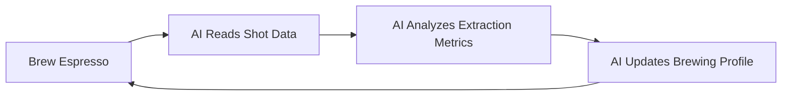

# Gaggimate MCP Repository Overview

## Project Summary

This repository implements a **Model Context Protocol (MCP) server** for Gaggimate-powered espresso machines, enabling AI agents to interact with and optimize espresso brewing profiles through an automated feedback loop.

**Key Innovation**: The system creates an AI-driven optimization loop where an AI agent (inspired by coffee expert James Hoffmann) can read shot performance data, analyze extraction quality, and automatically adjust brewing parameters to continuously improve espresso quality.

## Inspiration & Use Case

Based on the article ["Brew by AI"](https://archestra.ai/blog/brew-by-ai), this project demonstrates an innovative application of AI to automate the traditionally manual process of "dialing in" espresso — adjusting grind size, temperature, pressure, and extraction time to achieve optimal flavor.

### The AI Optimization Loop



**Process Flow**:
1. **Brew a shot** using the current "AI Profile"
2. **AI analyzes** temperature curves, pressure profiles, flow rates, and extraction metrics via MCP tools
3. **AI updates** the "AI Profile" with optimized parameters (temperature, pressure, flow, timing)
4. **Repeat** — the next shot uses the improved profile

## Technical Architecture

### Technology Stack

- **Language**: TypeScript (Node.js)
- **MCP SDK**: `@modelcontextprotocol/sdk` v0.5.0
- **Communication**: WebSocket (profiles) + HTTP (shot history)
- **Data Format**: Binary parsing of `.slog` shot files and `index.bin` history
- **Dependencies**: `ws` (WebSocket), `zod` (schema validation)

### System Components

#### 1. MCP Server (`src/index.ts`)
- **Entry point**: Implements MCP protocol over stdio transport
- **Configuration**: Environment variables for Gaggimate device connection
  - `GAGGIMATE_HOST`: Device hostname (default: `localhost`)
  - `GAGGIMATE_PROTOCOL`: WebSocket protocol `ws` or `wss` (default: `ws`)
- **Request handling**: Manages tool calls and WebSocket/HTTP communication

#### 2. Binary Parsers

**`src/parsers/binaryIndex.ts`**
- Parses `index.bin` shot history index
- Extracts shot metadata (ID, timestamp, profile info)

**`src/parsers/binaryShot.ts`**
- Parses `.slog` binary shot files
- Implements firmware-compatible binary format (mirroring `shot_log_format.h`)
- Decodes time-series data:
  - **Temperature**: Target and current temps (scaled by 10)
  - **Pressure**: Target and current pressure (scaled by 10)
  - **Flow**: Pump flow, puck flow, volumetric flow (scaled by 100)
  - **Weight**: Volumetric and estimated weight (scaled by 10)
  - **Resistance**: Puck resistance (scaled by 100)
- Supports v4 and v5 firmware formats
- Handles phase transitions and system info flags

#### 3. Data Transformers

**`src/transformers/shotTransformer.ts`**
- Converts raw binary shot data into AI-friendly JSON format
- Generates comprehensive shot summaries:
  - **Temperature stats**: Min, max, average, target average
  - **Pressure stats**: Min, max, average, peak time
  - **Flow stats**: Total volume, average/peak flow rates, time to first drip
  - **Extraction stats**: Total time, preinfusion duration, main extraction time
- Processes phase data with representative samples (beginning, middle, end)

### MCP Tools

The server exposes 5 MCP tools for AI interaction:

#### 1. `list_profiles`
**Purpose**: List all available brewing profiles
**Input**: None
**Output**: Array of profile objects with IDs, names, and settings

#### 2. `get_profile`
**Purpose**: Retrieve detailed information about a specific profile
**Input**: `profileId` (string)
**Output**: Complete profile configuration including phases, temperatures, pressures

#### 3. `update_ai_profile`
**Purpose**: Update or create the special "AI Profile" for experimentation
**Input**:
- `temperature` (number): Target water temperature in Celsius (60-100°C)
- `phases` (array): Brewing phases with:
  - `name`: Phase name (e.g., "Preinfusion", "Extraction")
  - `phase`: Type (`preinfusion` or `brew`)
  - `duration`: Duration in seconds
  - `temperature`: Phase-specific temperature
  - `pump`: Pressure or flow control settings
    - `target`: "pressure" or "flow"
    - `pressure`: Pressure in bar
    - `flow`: Flow rate in ml/s
  - `transition`: Transition settings (linear, ease-out, ease-in, instant)
  - `targets`: Stop conditions (pressure, flow, weight, volume thresholds)

**Safety**: Only modifies the "AI Profile" — prevents corruption of other profiles

**Output**: Updated profile confirmation

#### 4. `list_shot_history`
**Purpose**: List brewing history with pagination
**Input** (optional):
- `limit`: Maximum number of shots to retrieve
- `offset`: Number of shots to skip

**Output**: Array of shot summaries (ID, timestamp, profile, rating, duration, weight)

#### 5. `get_shot`
**Purpose**: Get detailed time-series data for a specific shot
**Input**: `shotId` (string)
**Output**: Comprehensive shot analysis including:
- **Metadata**: Profile info, timestamp, duration, final weight, scale connection status
- **Summary statistics**: Temperature, pressure, flow, extraction metrics
- **Phase data**: Per-phase analysis with representative samples

## Communication Protocols

### WebSocket API (Profiles)
- **Endpoint**: `ws://{GAGGIMATE_HOST}/ws`
- **Request format**: JSON with `tp` (type), `rid` (request ID), and parameters
- **Operations**:
  - `req:profiles:list` → `res:profiles:list`
  - `req:profiles:load` → `res:profiles:load`
  - `req:profiles:save` → `res:profiles:save`
- **Timeout**: 5 seconds per request

### HTTP API (Shot History)
- **Index endpoint**: `http://{GAGGIMATE_HOST}/api/history/index.bin`
- **Shot endpoint**: `http://{GAGGIMATE_HOST}/api/history/{shotId}.slog`
- **Format**: Binary octet-stream
- **Timeout**: 5 seconds per request

## Data Formats

### Profile Structure
```json
{
  "id": "profile-uuid",
  "label": "AI Profile",
  "type": "pro",
  "temperature": 93,
  "phases": [
    {
      "name": "Preinfusion",
      "phase": "preinfusion",
      "duration": 10,
      "temperature": 93,
      "pump": {
        "target": "pressure",
        "pressure": 2.5,
        "flow": 0
      },
      "transition": {
        "type": "linear",
        "duration": 2,
        "adaptive": true
      },
      "targets": []
    }
  ]
}
```

### Shot Data Structure
```json
{
  "metadata": {
    "shot_id": "000123",
    "profile_name": "AI Profile",
    "timestamp": "2025-01-25T10:30:00Z",
    "duration_seconds": 28.5,
    "final_weight_grams": 42.3,
    "bluetooth_scale_connected": true
  },
  "summary": {
    "temperature": {
      "average_celsius": 92.8
    },
    "pressure": {
      "average_bar": 8.2,
      "peak_time_seconds": 15.3
    },
    "flow": {
      "total_volume_ml": 45.2,
      "average_flow_rate_ml_s": 1.8
    },
    "extraction": {
      "preinfusion_time_seconds": 8.0,
      "main_extraction_seconds": 20.5
    }
  },
  "phases": [...]
}
```

## Deployment

### Docker
```bash
# Build
npm run build
docker build -t gaggimate-mcp .

# Run
docker run -e GAGGIMATE_HOST=gaggimate.local gaggimate-mcp
```

### NPX (Quick Start)
```bash
GAGGIMATE_HOST=gaggimate.local npx -y matvey-kuk/gaggimate-mcp
```

### Local Development
```bash
npm install
npm run dev
```

## Python Implementation Considerations

To build a Python equivalent of this TypeScript MCP server, you would need:

### Required Libraries
- **MCP SDK**: Python MCP SDK for protocol implementation
- **WebSocket**: `websockets` or `python-socketio` for WebSocket communication
- **HTTP Client**: `aiohttp` or `requests` for HTTP calls
- **Binary Parsing**: `struct` (built-in) for parsing binary shot files
- **Async Support**: `asyncio` for concurrent operations

### Architecture Mapping
```
TypeScript                     Python
─────────────────────────────────────────────────────
@modelcontextprotocol/sdk  →  mcp (Python SDK)
ws                         →  websockets
fetch                      →  aiohttp
Buffer/DataView            →  struct.unpack
TypeScript types           →  dataclasses/Pydantic
```

### Key Implementation Challenges
1. **Binary parsing**: Python's `struct` module requires careful format string construction to match the C-style binary format
2. **Async WebSocket**: Python's async/await pattern differs from TypeScript's Promise-based approach
3. **Type safety**: Use `dataclasses` or Pydantic for type-safe data models
4. **Error handling**: Implement similar timeout and error recovery mechanisms

### Suggested Python Structure
```
gaggimate_mcp_python/
├── src/
│   ├── __init__.py
│   ├── server.py              # MCP server setup
│   ├── tools.py               # Tool implementations
│   ├── parsers/
│   │   ├── binary_index.py    # Parse index.bin
│   │   └── binary_shot.py     # Parse .slog files
│   ├── transformers/
│   │   └── shot_transformer.py # Data transformation
│   └── api/
│       ├── websocket.py       # WebSocket client
│       └── http.py            # HTTP client
├── pyproject.toml
└── README.md
```

## Use Cases

1. **Autonomous espresso optimization**: AI continuously improves profiles based on extraction quality
2. **Recipe development**: AI explores parameter space to discover new flavor profiles
3. **Consistency maintenance**: AI adapts to changes in beans, grind settings, or ambient conditions
4. **Educational tool**: Learn about espresso extraction by observing AI adjustments
5. **Research platform**: Study relationships between brewing parameters and extraction outcomes

## Related Resources

- **Blog Article**: https://archestra.ai/blog/brew-by-ai
- **Gaggimate Firmware**: Open-source espresso machine firmware
- **MCP Protocol**: https://modelcontextprotocol.io/
- **Original TypeScript Repo**: https://github.com/matvey-kuk/gaggimate-mcp

## Local Setup Notes

- **Device**: Gaggimate espresso machine running at `http://gaggimate.local/`
- **WebSocket**: `ws://gaggimate.local/ws`
- **API**: `http://gaggimate.local/api/`

---

*Last updated: January 25, 2025*
